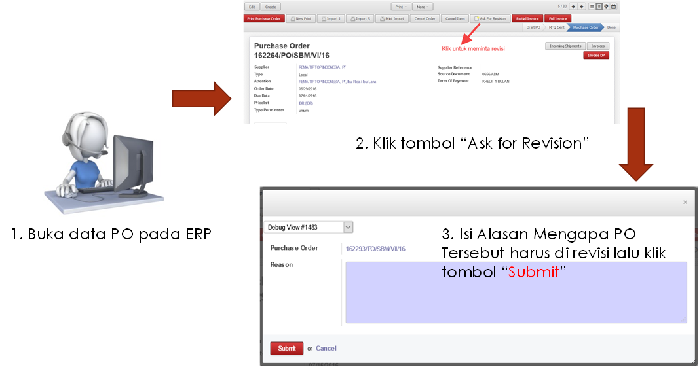
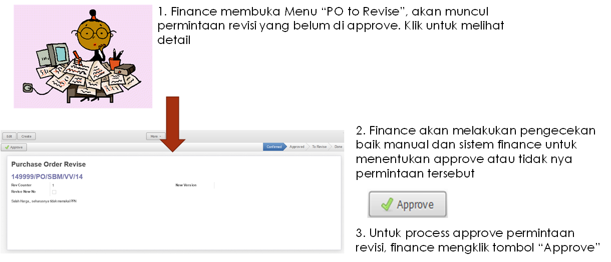
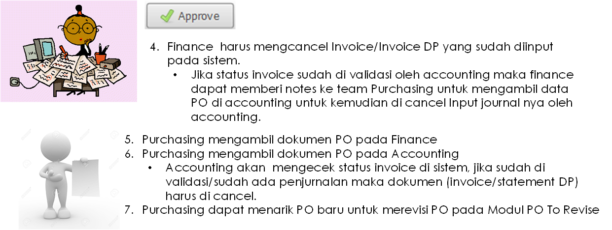
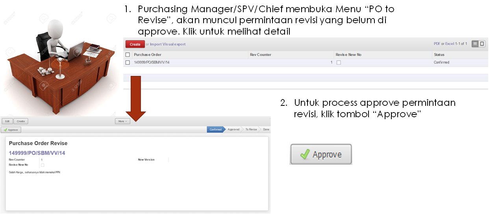

.. _content_purchase:

Purchase Order
==============

Purchase Order merupakan dokumen Pembelian Item baik barang maupun jasa yang di beli oleh Suprabakti Mandiri kepada Supplier.

Purchase Order terbagi dari 3 Jenis:

1. Purchase Order Regular
2. Purchase Order Rent
3. Purchase Order Subcont

.. _content_purchase_po_release:

Merelease PO
------------

Secara garis besar flow yang di terapkan dalam release PO adalah

.. figure:: img/flow-1.png
   :scale: 50%
   :alt: Flow Release Purchase Order

Penjelasan:

1. Input / Draft
   Input dilakukan oleh Staff Purchasing. Selama draft print out yang akan berlaku adalah draft PO (terdapat watermark “Draft”)
2. Confirm & Print
   Confirm dilakukan dengan mengklik “Confirm” dan setelah itu maka PO akan berubah statusnya menjadi “Waiting Approval”
   Status Waiting Approval mengindikasikan bahwa draft PO sudah disubmit dan sedang dalam pengajuan ke Manager Purchase (Atau Management yang berhak mentandatangani/approval PO)
   Jika PO yang di cetak tidak di approval maka Purchase Manger atau Bpk. Ary Ardianto (Staff Purchasing yang ditunjuk untuk berhak membuka PO menjadi Draft) dapat mengubah status PO menjadi draft dengan cara Klik tombol “Set to Draft”.
3. Apporve
   Pada saat PO ditandatangani maka Purchase Manager akan merubah Status PO di sistem menjadi “Purchase Order” dengan cara mengklik tombol “Approve Order”.
   Status “Purchase Order” pada sistem mengindikasikan bahwa PO tersebut sudah di approval oleh Management dan sudah di proses release PO kepada supplier.

1. Purchase Staff menginput PO pada modul ERP
2. Purchase Staff mengkonfirm PO untuk selanjutnya dapat di Print/Cetak
3. Setelah PO di cetak maka staff purchase harus meminta tanda tangan Purchase Manager
4. Purchase Manager mentandatangani PO dan meng-approve PO pada sistem ERP. Jika Purchase Manager berhalangan  untuk approval PO, maka PO akan ditandatangani oleh Finance Director (Ibu Susanti) dan untuk approval di sistem dapat diwakilkan oleh Purchase Chief/SPV/orang yang ditunjuk untuk approval di sistem ERP.
5. PO dapat di release ke Supplier.

.. _content_purchase_po_revision:

Merevisi PO
-----------

.. _content_purchase_po_revision_not_approved:

Revisi PO yang belum di Approve/Belum Release
^^^^^^^^^^^^^^^^^^^^^^^^^^^^^^^^^^^^^^^^^^^^^

Pada sub ini akan dijelaskan flow tata cara merevisi PO dimana PO tersebut belum pernah di approve / ditandatangani / disetujui oleh Manager (Pada sistem status nya masih **Waiting Approval**. 
Pada kondisi ini juga revisi yang diberlakukan adalah revisi tanpa mengubah nomor dokumen.

Berikut ini adalah flow activity diagramnya:

.. figure:: img/flow-revisi-draft.png
   :scale: 50%
   :alt: Flow Revisi PO - Belum Approval

Penjelasan:

1. Purchase Staff menginformasikan/menyampaikan kepada Purchase Chief/SPV/Staff yang diberikan hak untuk approval Revisi (Lebih baik melalui media tertulis).
2. Chief/SPV akan membuka dokumen PO dengan cara mengklik tombol "Set to Draft".
3. Otomatis PO akan berubah status nya menjadi "Draft", lalu staff dapat mengedit kembali PO pada ERP.

.. _content_purchase_po_revision_approved:

Revisi PO yang sudah di Approve/Sudah Release
^^^^^^^^^^^^^^^^^^^^^^^^^^^^^^^^^^^^^^^^^^^^^

PO yang sudah di approve / ditandatangani yang artinya sudah di setujui oleh Manager bahkan bisa saja sudah di release ke Supplier dapat di lakukan perubahan / revisi. Hasil revisi PO akan memakai nomor dokumen PO lama dengan menambahkan "REV{nomor urut perubahan}". Contoh: **160001/SBM/PO/I/16/REV1** menandakan bahwa PO ini merupakan versi revisi pertama dari nomor PO 160001.

Secara garis besar konsep revisi dapat digambarkan sbb:

.. figure:: img/flow-revisi-1.png
   :scale: 50%
   :alt: Garis besar konsep Revisi

Penjelasan:

1. Ask. Staff Purchasing meminta permintaan Revisi PO pada sistem ERP dengan menuliskan detail alasan mengapa PO bersangkutan harus dilakukan revisi. 
2. Permintaan Revisi harus di approval oleh Orang yang berwenang melakukan approval permintaan untuk merevisi PO.
3. Setelah PO di approval maka staff dapat merevisi PO dan merelease PO kembali.

Berikut ini adalah Use Case sistem dimana pada Use Case Diagram digambarkan proses-proses yang terjadi berserta actor/user yang melakukannya.:

.. figure:: img/use-case-revisi-po.png
   :scale: 50%
   :alt: Use Case Diagram Revisi PO

Proses Revisi PO dibagi 3 menurut kejadiannya:

1. :ref:`content_purchase_po_revision_approved_invoiced`
2. :ref:`content_purchase_po_revision_approved_not_invoiced`
3. :ref:`content_purchase_po_revision_not_approved`

.. _content_purchase_po_revision_approved_invoiced:

Revisi PO yang sudah terproses Invoice
~~~~~~~~~~~~~~~~~~~~~~~~~~~~~~~~~~~~~~

Jika PO sudah pernah merelease Invoice di sistem maka proses revisi akan melibatkan Departement Finance dan Accounting.

Berikut adalah tata cara flow merevisi PO yang sudah terproses invoice.

1. Ask

Ask ("Meminta") adalah flow untuk meminta persetujuan untuk merevisi dokumen PO. Hal ini dilakukan oleh Purchase Staff. Cara nya adalah:

2. Approve

Untuk kasus PO yang sudah terproses invoice, approval akan dilakukan oleh Finance. Team finance akan melakukan crosscheck di laporan finance dan akan memutuskan apakah permintaan untuk merevisi PO disetujui atau tidak.
Berikut adalah langkah dalam ERP:

3.Revise

Setelah proses Approval maka Purchase Staff dapat merevisi PO dengan cara:

1. Buka menu PO to Revise
	.. figure:: img/form-po-revise.png
	   :scale: 70%
	   :alt: Form PO Revise
2. Klik tombol "Create New Purchase Order". Setelah klik akan muncul PO dengan nomor REV. Pada PO tersebut silahkan edit dan revisi, lalu klik Tombol "Save" jika sudah selesai proses Editing.
3. Confirm PO. Setelah diconfirm maka PO dapat di print untuk meminta persetujuan Oleh Purchase Manager.
4. Jika disetujui maka Purchase Manager akan mentandatangani PO Revisi dan mengapprove PO di sistem ERP, dengan begitu PO dapat di proses selanjutnya. Jika sudah terjadi proses approval maka secara sistem dokumen PO versi lama akan berubah status menjadi "Cancel". Selain itu semua receiving yang sudah ada akan otomatis pindah ke dokumen PO versi Revisi.

.. _content_purchase_po_revision_approved_not_invoiced:

Revisi PO yang belum terproses Invoice
~~~~~~~~~~~~~~~~~~~~~~~~~~~~~~~~~~~~~~

Jika PO yang sudah di approval dan belum terproses invoice akan di revisi maka proses revisi hanya melibatkan Internal Departemen Purchasing.

1. Ask

Purchase staff meminta pengajuan untuk merevisi PO

2. Approval

Approval dilakukan oleh Purchase Chief/SPV jika PO belum di proses lebih lanjut oleh bagian Invoice (Finance).
Cara approval:

3.Revise

Setelah proses Approval maka Purchase Staff dapat merevisi PO dengan cara:

1. Buka menu PO to Revise
	.. figure:: img/form-po-revise.png
	   :scale: 70%
	   :alt: Form PO Revise
2. Klik tombol "Create New Purchase Order". Setelah klik akan muncul PO dengan nomor REV. Pada PO tersebut silahkan edit dan revisi, lalu klik Tombol "Save" jika sudah selesai proses Editing.
3. Confirm PO. Setelah diconfirm maka PO dapat di print untuk meminta persetujuan Oleh Purchase Manager.
4. Jika disetujui maka Purchase Manager akan mentandatangani PO Revisi dan mengapprove PO di sistem ERP, dengan begitu PO dapat di proses selanjutnya. Jika sudah terjadi proses approval maka secara sistem dokumen PO versi lama akan berubah status menjadi "Cancel". Selain itu semua receiving yang sudah ada akan otomatis pindah ke dokumen PO versi Revisi.
