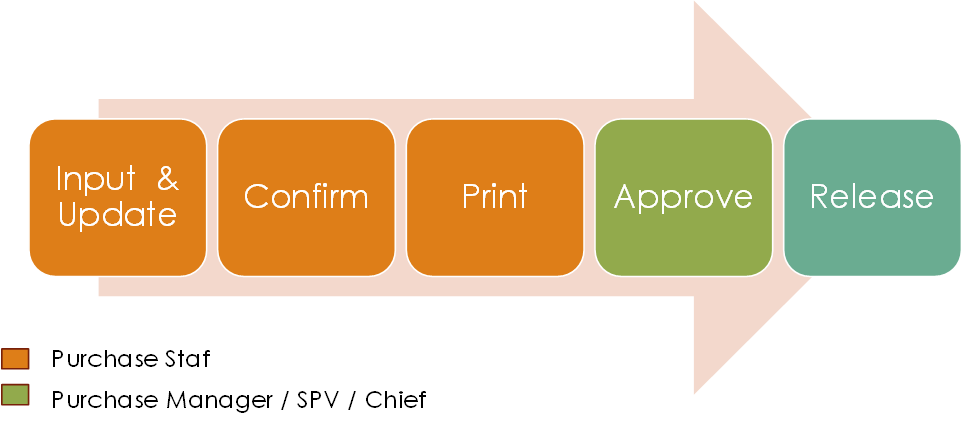

.. _content_purchase:

Purchase Order
==============

Purchase Order merupakan dokumen Pembelian Item baik barang maupun jasa yang di beli oleh Suprabakti Mandiri kepada Supplier.

Purchase Order terbagi dari 3 Jenis:

1. Purchase Order Regular
2. Purchase Order Rent
3. Purchase Order Subcont

.. _content_purchase_po_release:

Merelease PO
------------

Secara garis besar flow yang di terapkan dalam release PO adalah

Penjelasan:

1. Purchase Staff menginput PO pada modul ERP
2. Purchase Staff mengkonfirm PO untuk selanjutnya dapat di Print/Cetak
3. Setelah PO di cetak maka staff purchase harus meminta tanda tangan Purchase Manager
4. Purchase Manager mentandatangani PO dan meng-approve PO pada sistem ERP.
5. PO dapat di release ke Supplier.

.. _content_purchase_po_revision:

Merevisi PO
-----------

.. _content_purchase_po_revision_not_approved:

Revisi PO yang belum di Approve/Belum Release
^^^^^^^^^^^^^^^^^^^^^^^^^^^^^^^^^^^^^^^^^^^^^

Pada sub ini akan dijelaskan flow tata cara merevisi PO dimana PO tersebut belum pernah di approve / ditandatangani / disetujui oleh Manager. 
Pada kondisi ini juga revisi yang diberlakukan adalah revisi tanpa mengubah nomor dokumen.

Berikut ini adalah flow activity diagramnya:

Penjelasan: 

1. Untuk merevisi PO yang belum di approve maka User Staff dapat melakukan perintaan (terpisah) baik via email kepada Purchase Manager ataupun SPV/Chief yang ditunjuk.
2. Manager / SPV / staff yang ditunjuk akan membuka PO dan merubah status menjadi draft dengan cara mengklik tombol **Set to Draft** pada form Purchase Order.
3. Setelah dokumen diubah menjadi draft barulah staff purchasing dapat merubah/mengupdate PO.

.. _content_purchase_po_revision_approved:

Revisi PO yang sudah di Approve/Sudah Release
^^^^^^^^^^^^^^^^^^^^^^^^^^^^^^^^^^^^^^^^^^^^^

PO yang sudah di approve / ditandatangani yang artinya sudah di setujui oleh Manager bahkan bisa saja sudah di release ke Supplier dapat di lakukan perubahan / revisi. Hasil revisi PO akan memakai nomor dokumen PO lama dengan menambahkan "REV{nomor urut perubahan}". Contoh: **160001/SBM/PO/I/16/REV1** menandakan bahwa PO ini merupakan versi revisi pertama dari nomor PO 160001.

Secara garis besar konsep revisi dapat digambarkan sbb:

.. figure:: img/flow-revisi-1.png
   :scale: 50%
   :alt: Garis besar konsep Revisi

Penjelasan:

1. Ask. Staff Purchasing meminta permintaan Revisi PO pada sistem ERP dengan menuliskan detail alasan mengapa PO bersangkutan harus dilakukan revisi. 
2. Permintaan Revisi harus di approval oleh Orang yang berwenang melakukan approval permintaan untuk merevisi PO.
3. Setelah PO di approval maka staff dapat merevisi PO dan merelease PO kembali.

Berikut ini adalah Use Case sistem dimana pada Use Case Diagram digambarkan proses-proses yang terjadi berserta actor/user yang melakukannya.:

Proses Revisi PO dibagi 2 menurut kejadiannya:

1. :ref:`content_purchase_po_revision_approved_invoiced`
2. :ref:`content_purchase_po_revision_approved_not_invoiced`

.. _content_purchase_po_revision_approved_invoiced:

Revisi PO yang sudah terproses Invoice
~~~~~~~~~~~~~~~~~~~~~~~~~~~~~~~~~~~~~~

Jika PO sudah pernah merelease Invoice di sistem maka proses revisi akan melibatkan Departemen Finance dan Accounting.

.. _content_purchase_po_revision_approved_not_invoiced:

Revisi PO yang belum terproses Invoice
~~~~~~~~~~~~~~~~~~~~~~~~~~~~~~~~~~~~~~

Jika PO yang sudah di approval dan belum terproses invoice akan di revisi maka proses revisi hanya melibatkan Internal Departemen Purchasing.

