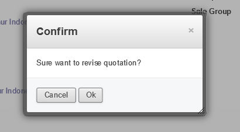

Order
=====

.. _content_order_quotation:

Quotation
---------

Quotation merupakan dokomen penawaran penjualan dari Sales Suprabakti ke Calon Customer.
Modul Quotation dapat diakses pada menu Sales -> Order -> Quotation.

.. _content_order_quotation_interface:

Tampilan Halaman Quotation
^^^^^^^^^^^^^^^^^^^^^^^^^^

.. _content_order_quotation_list:

List Quotation
~~~~~~~~~~~~~~

Ketika membuka menu "Quotation" maka yang pertama kali muncul di layar display adalah halaman List Quotation.
Berikut ini adalah tmapilan halaman list quotation: 

Pada halaman ini berisi daftar semua quotation yang pernah diinnput ke dalam sistem ERP dimana data quotation yang tampil adalah quotation yang berstatus belum di proses (baik belum turun po, belum deal dengan customer, dll).

User dapat mengklik salah satu data yang muncul pada tabel yang ada pada halaman ini untuk membuka data lebih detail. Ketika user mengklik data tersebut maka user akan di redirect ke halaman :ref:`content_order_quotation_view`

Pada **Panel Action** pada halaman list quotation terdapat tombol berwarna merah "Craete" .. image:: /img/button-create.png
Tombol tersebut dapat digunakan untuk menuju halaman :ref:`content_order_quotation_form` pada mode Input/Edit.

.. _content_order_quotation_view:

View Quotation
~~~~~~~~~~~~~~

Berikut ini adalah tampilan halaman View Quotation:

Dibagian atas konten terdapat informasi berupa nomor Quotation, Customer, Attention, nama sales, dll yang disebut sebagai informasi dasar penawaran.

Pada bagian tengah terdapat beberapa Tab Informasi yaitu Sale Item, Revision History dan Scope Of Work.
Selain itu di bawah tabular form terdapat informasi seperti Term Payment, notes, Harga, total PPN, dll.

Pada bagian bawah halaman terdapat foot notes log history yang menunjukan track record log history perubahan dokumen dari waktu ke waktu.

.. _content_order_quotation_form:

Form Quotation
~~~~~~~~~~~~~~

Berikut ini adalah tampilan dari form quotation:

Pada dasarnya tampilan form quotation mirip dengan :ref:`content_order_quotation_view`. Namun yang menjadi pada halaman ini field field informasi berubah menjadi field inputan yang dapat diisi/diubah oleh user.

.. _content_order_field_quotation:

Informasi pada Quotation
^^^^^^^^^^^^^^^^^^^^^^^^

Field-field dasar pada quotation adalah:

+---+-----------------------+---------------+------------------------------------------------------------------------------------------+
|NO | Fileds                | Harus Diisi   | Keterangan                                                                               |
+===+=======================+===============+==========================================================================================+
|1  | Customer              | Ya            |Nama / Data Customer, nama perusahaan Customer                                            |
+---+-----------------------+---------------+------------------------------------------------------------------------------------------+
|2  | Delivery Address      | Ya            |Nama Site / Alamat tempat Pengiriman yang akan dituju                                     |
+---+-----------------------+---------------+------------------------------------------------------------------------------------------+
|3  | Attention             | Tidak         |Nama Orang yang dituju untuk penawaran                                                    |
+---+-----------------------+---------------+------------------------------------------------------------------------------------------+
|4  | Invoice Address       | Tidak         |Alamat yang akan digunakan untuk Cetak Invoice                                            |
+---+-----------------------+---------------+------------------------------------------------------------------------------------------+
|5  | Currency              | Ya            |Mata uang yang digunakan dalam transaksi                                                  |
+---+-----------------------+---------------+------------------------------------------------------------------------------------------+
|6  | Date                  | Ya            |Tanggal Penawaran                                                                         |
+---+-----------------------+---------------+------------------------------------------------------------------------------------------+
|7  | Sales Person          | Ya            |Nama sales yang menawarkan                                                                |
+---+-----------------------+---------------+------------------------------------------------------------------------------------------+
|8  | Sale Group            | Ya            |Group Sales yang menawarkan                                                               |
+---+-----------------------+---------------+------------------------------------------------------------------------------------------+
|9  | Payment Term          | Ya            |Term Payment Sistem yang diberlakukan                                                     |
+---+-----------------------+---------------+------------------------------------------------------------------------------------------+
|10 | Create Invoice        | Ya            |Trigger untuk membuat invoice :                                                           |
|   |                       |               |   1. On Demand - Invoice akan dibuat sesuai permintaan                                   |
|   |                       |               |   2. On Delivery Order - Invoice akan dikirim setelah barang dikirim / diterima          |
|   |                       |               |   3. Before Delivery - Invoice akan dikirim bersamaan dengan pengiriman barang           |
+---+-----------------------+---------------+------------------------------------------------------------------------------------------+
|11 | Term and Conditions   | Tidak         |Group Sales yang menawarkan                                                               |
+---+-----------------------+---------------+------------------------------------------------------------------------------------------+
|12 | Base Total            | Tidak         |Informasi Total nilai Sebelum Discount                                                    |
+---+-----------------------+---------------+------------------------------------------------------------------------------------------+
|13 | Discount              | Tidak         |Informasi nilai total discount dalam penawaran                                            |
+---+-----------------------+---------------+------------------------------------------------------------------------------------------+
|14 | Sub Total             | Tidak         |Informasi Total nilai setelah Discount / Dasar Pengenaan Pajak (DPP)                      |
+---+-----------------------+---------------+------------------------------------------------------------------------------------------+
|15 | Tax                   | Tidak         |Informasi nilai pajak yang dikenakan dalam penawaran                                      |
+---+-----------------------+---------------+------------------------------------------------------------------------------------------+
|16 | Total                 | Tidak         |Total nilai transaksi                                                                     |
+---+-----------------------+---------------+------------------------------------------------------------------------------------------+
|17 | Sale Items            | Ya            |List item / produk yang di tawarkan                                                       |
+---+-----------------------+---------------+------------------------------------------------------------------------------------------+
|18 | Revision History      | Tidak         |List Data Revisi yang pernah dilakukan, terisi otomatis pada saat dilakukan revisi pada   |
|   |                       |               |dokumen                                                                                   |
+---+-----------------------+---------------+------------------------------------------------------------------------------------------+
|19 | Scope Of Work         | Tidak         |Berisi Scope of work baik dari sisi Customer maupun Suprabakti Mandiri                    |
+---+-----------------------+---------------+------------------------------------------------------------------------------------------+

Selain itu pada quotation juga mempunyai beberapa Tab yaitu Sale Items, Revision History, Scope of Work.
Pada tab **Sale Items** terdapat field field dibawah ini:

+---+-----------------------+---------------+--------------------------------------------------------------------------------------------------------------------+
|NO | Fileds                | Harus Diisi   | Keterangan                                                                                                         |
+===+=======================+===============+====================================================================================================================+
|1  | Product               | Ya            | Item yang akan ditawarkan                                                                                          |
+---+-----------------------+---------------+--------------------------------------------------------------------------------------------------------------------+
|2  | Description           | Tidak         | Deskripsi item yang ditawarkan                                                                                     |
+---+-----------------------+---------------+--------------------------------------------------------------------------------------------------------------------+
|3  | Qty                   | Ya            | Banyaknya item yang ditawarkan, berserta satuannya (Satuan bisa dalam 1 satuan kumulatif, seperti lot, set dll)    |
+---+-----------------------+---------------+--------------------------------------------------------------------------------------------------------------------+
|4  | Unit Price            | Ya            | Harga item per satuan                                                                                              |
+---+-----------------------+---------------+--------------------------------------------------------------------------------------------------------------------+
|5  | Discount              | Tidak         | Field Sebelah kiri merupakan discount dalam persentase (%), di sebelah kanan merupakan disocunt dalam angka nilai  |
+---+-----------------------+---------------+--------------------------------------------------------------------------------------------------------------------+
|6  | Base Total            | Tidak         | Harga total kotor, yaitu harga unit price x qty sale                                                               |
+---+-----------------------+---------------+--------------------------------------------------------------------------------------------------------------------+
|7  | Subtotal              | Tidak         | Total harga setelah dikurangi discount,                                                                            |
+---+-----------------------+---------------+--------------------------------------------------------------------------------------------------------------------+
|8  | Taxes                 | Tidak         | Pajak yang dikenakan untuk suatu item                                                                              |
+---+-----------------------+---------------+--------------------------------------------------------------------------------------------------------------------+
|9  | Tax Amount            | Tidak         | Total nilai pajak yang dikenakan pada 1 sale item tersebut                                                         |
+---+-----------------------+---------------+--------------------------------------------------------------------------------------------------------------------+
|10 | Material Line         | Ya            | Berisi list material (baik jasa/barang) yang di sertakan pada item penawaran, misalnya item penawaran 1 jasa       |
|   |                       |               | include beberapa material item.                                                                                    |
|   |                       |               |                                                                                                                    |
|   |                       |               | |img_material_line|                                                                                                |
+---+-----------------------+---------------+--------------------------------------------------------------------------------------------------------------------+

.. |img_material_line| image:: /img/order-material-line.png
   :width: 50%

Pada object tab Material Line terdapat beberapa field :

+---+-----------------------+---------------+--------------------------------------------------------------------------------------------------------------------+
|NO | Fileds                | Harus Diisi   | Keterangan                                                                                                         |
+===+=======================+===============+====================================================================================================================+
|1  | Material Item         | Ya            | Item yang akan di supply untuk suatu order                                                                         |
+---+-----------------------+---------------+--------------------------------------------------------------------------------------------------------------------+
|2  | Description           | Tidak         | Deskripsi item                                                                                                     |
+---+-----------------------+---------------+--------------------------------------------------------------------------------------------------------------------+
|3  | Qty                   | Ya            | Qty yang akan dikirim dari material                                                                                |
+---+-----------------------+---------------+--------------------------------------------------------------------------------------------------------------------+
|4  | Unit                  | Ya            | Satuan unit dari material yang akan dikirim                                                                        |
+---+-----------------------+---------------+--------------------------------------------------------------------------------------------------------------------+
|5  | Picking Location      | Ya            | Sumber Tempat/Site/Warehouse stock material tersebut berada                                                        |
+---+-----------------------+---------------+--------------------------------------------------------------------------------------------------------------------+

Pada **Tab Revision History** terdapat field-field dibawah ini:

+---+-----------------------+---------------+--------------------------------------------------------------------------------------------------------------------+
|NO | Fileds                | Harus Diisi   | Keterangan                                                                                                         |
+===+=======================+===============+====================================================================================================================+
|1  | No#                   | Tidak         | Nomor Quotation                                                                                                    |
+---+-----------------------+---------------+--------------------------------------------------------------------------------------------------------------------+
|2  | Total (Tax Exclude)   | Tidak         | Total nilai penawaran yang direvisi                                                                                |
+---+-----------------------+---------------+--------------------------------------------------------------------------------------------------------------------+
|3  | Reason of Revision    | Tidak         | Alasan / Penjelasan mengapa penawaran tersebut di revisi                                                           |
+---+-----------------------+---------------+--------------------------------------------------------------------------------------------------------------------+
|4  | Date                  | Tidak         | Tanggal Revisi                                                                                                     |
+---+-----------------------+---------------+--------------------------------------------------------------------------------------------------------------------+

Dan terakhir adalah **Tab Scope of Work**. Pada tab ini terdapat 2 field yaitu:
1. Field **Scope Of Work Suprabakti Mandiri**. Dimana field ini digunakan sebagai informasi scope of work dari suatu penawaran yang dilakukan oleh team dari Suprabakti Mandiri.
2. Field **Scope of Work Customer**. Field ini digunakan sebagai informasi scope of work yang harus dipenuhi/dilakukan oleh customer.

.. _content_order_quotation_states:

Status Dokumen Quotation/Penawaran
^^^^^^^^^^^^^^^^^^^^^^^^^^^^^^^^^^

Berikut ini penjelasan mengenai status yang ada pada dokumen Penawaran.

.. list-table:: Penjelasan Status Quotation/Penawaran
   :widths: 15 30
   :header-rows: 1

   * - Status
     - Penjelasan
   * - Draft
     - Dokumen draft masih bisa di ubah isi konten nya
   * - Confirmed
     - Quotation siap untuk di release ke Customer. Pada status ini juga kemungkinan sedang tahap approval yang akan menentukan apakah penawaran diterima, ditolak, postpone, atau revisi.
   * - Win
     - Quotation sudah di approve oleh Customer dan sudah turun PO
   * - Lose
     - Gagal, kalah dalam tender, dll. Dalam keadaan ini penawaran tidak perlu di follow up kembali serta akan masuk data laporan data kekalahan penawaran.
   * - Cancel
     - Dokumen telah dicancel karena suatu sebab. Biasanya karena kesalahan user.

.. _content_order_flow_quotation:

Flow Quotation/Penawaran
^^^^^^^^^^^^^^^^^^^^^^^^

   Flow Quotation

   #. Flow dimulai dengan user menginput penawaran , dimana pada flow state ini form penawaran diinput oleh Sales melaui ERP pada modul menu Quotation / RFQ.
   #. Selanjutnya setelah inputan sudah lengkap maka user dapat mencetak penawaran di kertas dengan meng-konfirm dokumen terlebih dahulu. Pada state ini dokumen sudah fix dan tidak dapat diubah. Atau user dapat meng-cancel dokumen tersebut jika dokumen benar-benar tidak akan digunakan
   #. Selanjutnya setelah penawaran diterima oleh Customer maka akan ada proses negosiasi, dari proses tersebut ada beberapa kemungkinan yaitu Revisi Penawaran, Deal, dan Tidak Deal / Lose a. Jika ingin merevisi penawaran maka user dapat merevisi penawaran di sistem lalu mengkonfirm kembali untuk mencetak revisi penawaran b. Jika pada saat negosiasi menghasilkan kesepakatan Jual Beli maka ketika turun PO dari Customer user dapat mengubah status penawaran menjadi Sale Order. Jika tidak ada kesepakatan atas penawaran tersebut maka user dapat mengubah status dokumen menjadi **lose** pada penawaran tersebut

Untuk lebih detail dijelaskan pada sub modul berikutnya:

.. _content_order_quotation_input:

Input Penawaran (Baru)
~~~~~~~~~~~~~~~~~~~~~~

Untuk menginput penawaran baru, dapat dilakukan dengan cara **Mengklik tombol "Create"** .. image:: /img/button-create.png.

Ketika mengklik button create maka user akan diredirect ke halaman :ref:`content_order_quotation_form`.
Pada :ref:`content_order_quotation_form` maka  user dapat menginput informasi lengkap mengenai penawaran yang akan dibuat.

Namun sebelumnya ada beberapa informasi yang harus dikumpulkan untuk mengisi form penawaran. Adapun informasinya adalah:

1. Detail Nama, alamat lengkap serta no tlp Calon Customer. [#f_customer_data]_
2. Part Number yang ditawarkan berikut dengan part number material/jasa lain yang disertakan dalam 1 harga item penawaran.

Jika hal tersebut diatas sudah siap maka user dapat **klik tombol "Save"** untuk menyimpan data draft penawaran. [#f_draft_quotation]_

Jika penawaran sudah tersimpan (dengan mengklik tombol save) maka penawaran dapat di confirm untuk dapat di print. Lihat bagian :ref:`content_order_quotation_confirm`

.. epigraph::

   Silahkan lihat referensi link dibawah ini untuk lebih detail:

    - :ref:`faq_membuat_penawaran_step`:
    - :ref:`faq_membuat_penawaran_material_include_jasa`:
    - :ref:`faq_membuat_penawaran_material_include_material`:

   
   (Animasi: Gambaran Menginput Penawaran)

.. rubric:: Footnotes Input Penawaran

.. [#f_customer_data] Data Informasi dasar Customer sangat dibutuhkan dan harus dilengkapi pada penawaran. Minimal diawal pembuatan Penawaran user sudah harus tahu Nama PT, Alamat (Head Office), Alamat Pengiriman, serta informasi kontak person dari customer. Untuk tatacara pengisian master data dapat dilihat pada bagian :ref:`content_kontak_customer`
.. [#f_draft_quotation] Selama status penawaran masih draft maka user dapat mengedit/mengubah penawaran.

.. _content_order_quotation_confirm:

Confirm Penawaran
~~~~~~~~~~~~~~~~~

Confirm penawaran dapat dilakukan jika user sudah menginput penawaran baru (lihat :ref:`content_order_quotation_confirm`).
Confirm penawaran dilakukan jika penawaran yang diinput disistem sudah valid data dan penawaran akan di release (print out) ke Customer.

Confirm penawaran dapat dilakukan dengan cara:

 1. Klik tombol |img_button_confirm| yang terdapat pada Panel Action :ref:`content_order_quotation_view`.
 2. Status dokumen akan berubah menjadi "Confirmed". [#f_confirmed_quotation]_ |img_status_confirmed|
 3. Dokumen dapat dicetak langsung ke kertas. (Lihat bagian :ref:`content_quotation_print`)

.. |img_button_confirm| image:: /img/button-confirm.png
   :height: 15px

.. figure:: img/gif/confirm_penawaran.gif
   :scale: 50%
   :alt: Cetak Quotation
   
   (Animasi: Confirm Penawaran)

.. rubric:: Footnotes Confirm Penawaran

.. [#f_confirmed_quotation] Penawaran yang berstatus "Confirmed" dapat di cetak / print dan dapat di revisi dengan melakukan Revisi Penawaran

.. _content_quotation_print:

Print Penawaran
~~~~~~~~~~~~~~~

Syarat utama untuk dapat mencetak dokumen penawaran adalah:

 #. Terkoneksi dengan jaringan Lan/WAN Kantor Suprabakti Mandiri.
 #. Status dokumen adallah **"Draft"**

Jika status dokumen **"Confirmed"** maka user dapat melihat tombol **"Print"**.

Klik tombol Print lalu akan muncul tampilan print out dokument seperti ini:

   
   Print Out Quotation

Ketika halaman print out sudah terbuka dan print sudah valid maka user dapat mencetak dokumen dengan cara menekan keyboard ctrl+p. (Lihat bag. Print Browser)

Revisi Penawaran
~~~~~~~~~~~~~~~~

Jika diharuskan mengubah penawaran [#f_ubah_penawaran]_ maka user dapat merevisi penawaran yang sudah berstatus "Confirmed" dengan cara:
 1. Klik Tombol |img_button_revise| pada panel action :ref:`content_order_quotation_view`
 2. Akan muncul Warning seperti ini : |img_warn_revise|, klik Ok
 3. Setelah itu akan muncul form Alasan Revisi, dimana user diwajibkan(diharuskan) mengisi alasan merevisi penawaran. |img_form_reason_revise|
 4. Jika form alasan revisi sudah diisi maka user dapat Klik Tombol |img_button_confirm| pada bagian bawah form.
 5. Jika berhasil dan maka status dokumen quotation akan kembali menjadi **"Draft"** dimana pada status draft user dapat mengedit isi konten dokumen. Lalu nomor quotation terdapat penambahan nomor revisi di akhir bagan nomor. Contoh : **RFQ/16/06/00003/Rev-1** yang menunjukkan bahwa RFQ 00003 di tahun 2016 versi revisi nomor 1. Selain itu pada tab Revision History akan terisi data kapan dan mengapa dokumen quotation di revisi. |img_tab_revision1|

Quotation yang dapat direvisi adalah Quotation yang berstatus "Confirmed".

.. rubric:: Footnotes Revisi Penawaran

.. [#f_ubah_penawaran] Merubah penawaran seperti perubahan spesifikasi,, penurunan harga,, merevisi kesalahan data, dll dimana diharuskan untuk merubah isi konten baik sepsifikasi, material, harga maupun rules yang tercantum dalam penawaran.

.. _content_order_quotation_flow_lost:

Lost Quotation
~~~~~~~~~~~~~~

Lost quotation digunakan untuk merubah status Quotation menjadi "Lost".

Untuk mengubah status dokumen dapat dilakukan dengan cara:

 1. Klik tombol |img_button_lost| setelah itu akan muncul form seperti ini
    |img_form_reason_lost|
 2. Pada form input alasan gagalnya penawaran lalu klik "Confirm"
 3. Jika berhasil maka status akan berubah menjadi **"Lost"** |img_quotation_status_lost|

 .. |img_button_lost| image:: img/button-lost.png
    :height: 20px

.. _content_order_quotation_flow_win:

Win Quotation
~~~~~~~~~~~~~

Win Quotation dilakukan ketika Penawaran berhasil diterima oleh Customer, dan Customer sudah merelease PO pembelian kepada Suprabakti Mandiri.
Dalam hal ini semua dokumen penawaran yang berstatus **WIN** secara sistem akan berubah menjadi Dokumen Sale Order (disingkat **S.O**). (Lihat bag. :ref:`content_order_sale_order`)

Untuk merubah status dokumen quotation menjadi win maka dokumen yang harus dipersiapkan adalah:
 1. PO yang release dari Customer

Win Quotation dapat dilakukan dengan cara:
 1. Klik tombol |img_button_win|, setelah itu akan muncul form win quotation seperti ini 
    |img_quotation_win_form|

 2. Pada form win quotation isi dengan lengkap field field yang ada.

  - **PO/Customer** Ref No diisi dengan nomor PO atau nomor referensi dokumen pembelian resmi dari customer
  - **Date Order** diisi dengan tanggal release PO Customer
  - **Due Order** diisi dengan tanggal batas waktu Order harus di terima Customer.
  - **Delivery Date** diisi dengan  batas waktu pengiriman item ke Customer.

.. _content_order_quotation_flow_cancel:

Cancel Quotation
^^^^^^^^^^^^^^^^

Pada saat proses penawaran penjualan pada Customer terdapat beberapa kemungkinan yang akan terjadi yaitu pembatalan penawaran (Cancel), penawaran dimenangkan (Win), atau penawaran gagal (Lost).

- Penawaran dibatalkan  ketika hasil dari proses penginputan data pada form Qutation belum sampai pada tahap dikonfirmasi. Untuk melakukan pembatalan dari penawaran penjualan yaitu dengan menekan tombol Cancel.

.. image:: /img/mp-cancel.png

- Dengan dilakukannya Cancel dari penawaran penjualan maka status dari penawaran telah berubah menjadi Cancel.

.. image:: /img/mp-cancelst.png

.. _content_order_quotation_decimal:

System Perhitungan dan Desimal
^^^^^^^^^^^^^^^^^^^^^^^^^^^^^^

Berikut adalah tabel sistem yang diberlakukan pada field field

.. list-table:: Penjelasan Status Quotation/Penawaran
   :widths: 5 15 15 30
   :header-rows: 1

   * - No
     - Nama Field ERP
     - Keterangan
     - Aturan

   * - 1 
     - Price per Unit
     - Harga Satuan Per Unit
     - 2 Desimal, Pembulatan ke atas. 

       Contoh:

        - 16,161.616 **dibulatkan menjadi 16,161.62**
        - 16,161.611 **dibulatkan menjadi 16,161,61**
        - 16,161.6156 **dibulatkan menjadi 16,161.62**
        - 16,161.61447 **dibulatkan menjadi 16,161.61**

   * - 2 
     - Discount (%) pada Sale Items
     - Diskon persentase
     - 3 Desimal, Pembulatan keatas.

   * - 3
     - Discount (Amount) pada Sale Items
     - Diskon dalam Angka Kurs
     - 3 Desimal, Pembulatan keatas.

   * - 4
     - Subtotal (Subtotal Semua Item), Total PPN/Pajak
     - Subtotal Penawaran dan Total PPN/Pajak
     - 0 Desimal, Pembulatan Kebawah

       Contoh:

        - 16,161.62 dibulatkan menjadi **16,162.00**
        - 16,161.12 menjadi **16,161.00**

.. _content_order_quotation_case:

Contoh Kasus
^^^^^^^^^^^^

tes

.. _content_order_sale_order:

Sale Order
----------

Sale Order merupakan dokumen penjualan khususnya penjualan PT. Suprabakti Mandiri yang berisi:
 1. Daftar item baik material maupun jasa berserta harga yang di sepakati antara 2 belah pihak (Customer dan Suprabakt Mandiri)
 2. Perjanjian Term Of Payment
 3. Scope Of Work baik di sisi Customer maupun Suprabakti Mandiri
 4. Perjanjian kesepakatan lainnya (waktu, tempat, dll).

Yang di pesan oleh Customer melalui Team Sales Suprabakti yang tertuang dalam dokumen pembelian (Purchase Order) yang di release oleh pihak Customer.

Pada ERP dokumen **Sale Order** merupakan hasil koversi dari dokumen Quotation, dengan kata lain Sale Order diinput berdasarkan hasil dari Penawaran/Quotation. Oleh karena itu untuk menginput Sale Order anda dapat melihat bag. :ref:`content_order_quotation_input` untuk membuat dokumen penawaran lalu dapat mengkonversi Dokumen :ref:`content_order_quotation` menjadi Sale Order yang dapat dilihat pada bagian ini :ref:`content_order_quotation_flow_win`.

.. _content_order_sale_order_flow:

Flow Sale Order
^^^^^^^^^^^^^^^

Flow Sale Order description.

.. figure:: img/gif/confirm_penawaran.gif
   :scale: 50%
   :alt: Cetak Quotation
   
   (Animasi: Confirm Penawaran)

Menginput Sale Order
^^^^^^^^^^^^^^^^^^^^

Sale Order diinput melalui modul :ref:`content_order_quotation`.
Silahkan melihat bagian :ref:`content_order_quotation_input` untuk melihat bagaimana cara menginput dokumen :ref:`content_order_quotation`.

Adhoc Order
-----------

Adhoc Order merupakan dokumen internal penjualan PT. Suprabakti Mandiri yang bersifat 