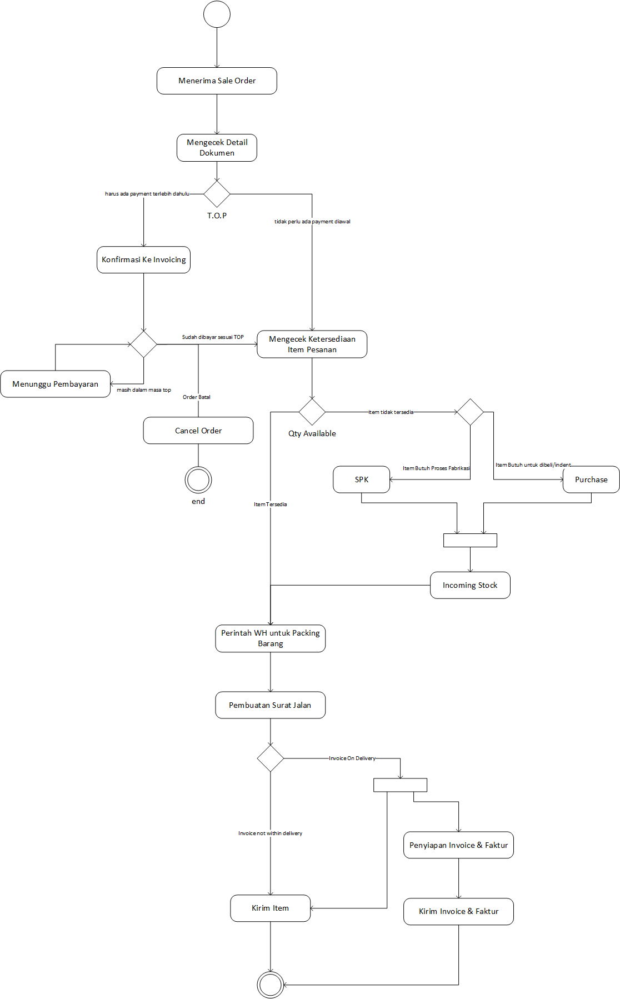

.. _content_order_process:

Memproses Order
===============

Setelah ada nya dokumen :ref:`content_order_sale_order` maka langkah selanjutnya adalah memproses permintaan berdasarkan :ref:`content_order_sale_order`. 
Untuk detail soal flow yang harus dilakukan untuk dapat memproses Sale Order dapat dilihat pada sub bagian berikut nya (:ref:`content_order_process_flow`).

.. _content_order_process_flow:

Flow
----

Berikut ini adalah flow dari Proses Sale Order:

order-process-flow

   
   (Animasi: Flow Memproses Order)

   Penjelasan:

   #. Pada flow terlihat bahwa proses order dimulai dengan diterima nya dokumen Sale Order oleh Dept. Admin HO.

   #. Selanjutnya Admin HO **Mengecek Detail Dokumen**. Pada flow ini Admin HO harus akan mengecek kelengkapan isis dokumen berserta field-field yang dibutuhkan(cth: Alamat Pengiriman, TOP, Scope Work, Notes, dll)
   
   #. Dari hasil pengecekan dapat diketahui **Term Of Payment** dari Sale Order tersebut dan akan diberlakukan beberapa kondisi tergantung dari kesepakatan Term Of Payment yang tercantum dalam Sale Order.
    - Kondisi pertama jika Term of Payment dari suatu order yang akan di proses **mengharuskan adanya pembayaran diawal** (lihat [#f_order_process_pembayaran_awal]_ ) maka Team Admin Support dapat mengecek secara manual ke bagian Admin HO Invoice untuk mengecek status pembayaran dari order tersebut. Dan jika sudah melewati jatuh tempo pembayaran sesuai TOP yang disepakati maka team Invoice **wajib mengkonfirmasikan** kepada team Deliver bahwa payment dibatalkan karena tidak memenuhi **TOP**. Pada saat team Admin HO mengetahui hal tersebut maka team Admin HO dapat merubah status order menjadi **Cancel** dengan menjalankan flow **Cancel Orer**. 
    - Kondisi kedua adalah jika **Term of Payment** yang disepakati **tidak mengharuskan proses pembayaran di muka** maka flow dapat dilanjutkan ke **mengecek ketersediaan barang**.
   #. 

.. rubric:: Footnotes Order Process

.. [#f_order_process_pembayaran_awal] Mengharuskan adanya pembayaran diawal seperti DP/Uang Muka, Full Payment di muka tergantung perjanjian kontrak

.. _content_order_process_picking:

Menyiapkan (Packing) dan Mengirim Item Order
--------------------------------------------

Untuk dapat melakukan penyiapan item yang dipesan hal-hal yang perlu diperhatikan adalah:

- Term Of Payment valid dan jelas.
- Informasi PO Customer sudah Jelas.
- Item yang dipesan sudah detail dan Jelas.
- Alamat Pengiriman sudah lengkap dan Jelas.
- Scope Of Work sudah jelas.

.. _content_order_process_invoice:

Membuat Invoice Order
---------------------

Untuk dapat membuat invoice hal-hal yang perlu diperhatikan adalah:

